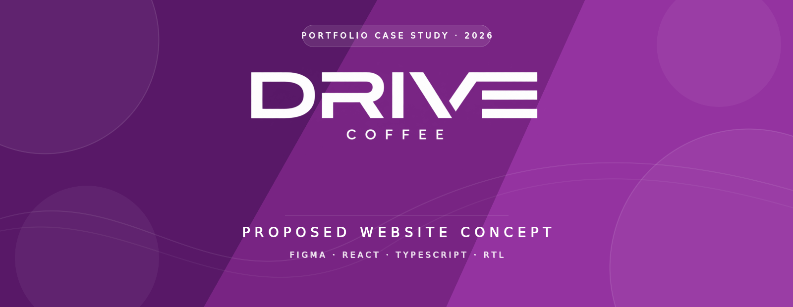

[README.md](https://github.com/user-attachments/files/31412128/README.md)

  

  
  
  
  

  <strong>A responsive Arabic digital experience designed around DRIVE Coffee's visual identity.</strong>

---

## ✦ About the Concept

**DRIVE Coffee Website** is a proposed front-end concept that explores how the brand's distinctive identity can be translated into a modern, interactive digital experience.

The interface was designed in **Figma** and developed with **React** and **TypeScript**, with a strong focus on responsive Arabic layouts, smooth interaction, visual consistency, and an intuitive browsing experience across desktop and mobile devices.

> This is an independent portfolio concept and not the official DRIVE Coffee website. The source code is kept private.

## ✦ Project Walkthrough

<!-- Replace VIDEO-LINK-HERE with your Google Drive, YouTube, or portfolio video link before publishing. -->

  <a href="https://drive.google.com/file/d/1fH_12bbLHg7tMd2Q6L_d0bDl0PzLRfoz/view?usp=drivesdk"><strong>▶ Watch the Full Website Experience</strong></a>

## ✦ Experience Highlights

- **Brand-led interface** using DRIVE's signature purple and cream palette
- **Arabic-first experience** with complete RTL layout support
- **Responsive design** optimized for desktop, tablet, and mobile screens
- **Animated logo loader** with a directional brand-fill effect
- **Smooth section navigation** with sticky navigation and active-state tracking
- **Interactive menu** with product categories, pricing, and calorie details
- **Loyalty experience** featuring an animated five-cups-plus-one reward journey
- **Interactive branch finder** with search, regional filtering, and geolocation
- **Catering and partner showcase** presented through editorial visual layouts
- **Branded contact experience** with custom form and selection controls
- **Motion system** created with Framer Motion and reduced-motion support

## ✦ Featured Sections

| Section | Experience |
| :--- | :--- |
| **Hero** | Brand statement, immersive photography, and animated content |
| **Our Story** | Editorial storytelling with responsive visual composition |
| **Menu** | Interactive drinks showcase with sticky category navigation |
| **Loyalty** | Animated reward journey connected to the loyalty experience |
| **Services** | Catering presentation aligned with the brand's visual language |
| **Partners** | Strategic partner showcase with clean transparent assets |
| **Branches** | Interactive map, filters, search, and nearest-branch discovery |
| **Contact** | Branded contact card with refined custom controls |

## ✦ Tools & Technologies

  
  
  
  
  
  
  

## ✦ My Role

- UI concept and visual direction in Figma
- Responsive front-end development with React and TypeScript
- Arabic RTL layout implementation
- Component styling and design-system consistency
- Interactive motion and scroll experience
- Menu, loyalty, partner, and branch-finder experiences
- Responsive testing and interface refinement

## ✦ Repository Scope

This public repository is intentionally presented as a **portfolio case study**. It contains the project overview and visual presentation only; the implementation source code remains private.

## ✦ Created by

  <strong>Lama Alrasheed</strong> 
  Web Developer

  
  

---

DRIVE Coffee and its related names, logos, trademarks, and visual assets belong to their respective owners. This proposed concept was created independently for portfolio and educational purposes and is not affiliated with or endorsed by DRIVE Coffee.

